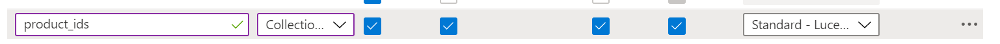

# azure-search-custom-skill

Steps to use this custom skill:

1. Adapt regex
1. Deploy skill to Azure Function (Python) using `vscode`s or `az cli`
1. Add skill entry to skillset and adapt fields
    ```
    ...
    {
        "@odata.type": "#Microsoft.Skills.Custom.WebApiSkill",
        "name": "productids",
        "description": "RegEx extraction Skill",
        "uri": "https://<name>.azurewebsites.net/api/RegexExtractor?code=<key>",
        "context": "/document/merged_content",
        "inputs": [
        {
            "name": "text",
            "source": "/document/merged_content"
        }
        ],
        "outputs": [
        {
            "name": "matches",
            "targetName": "product_ids"
        }
        ]
    },
    ...
    ```
1. Create new field of type `Collection(Edm.String)` in index
    
1. Add entry for `outputFieldMappings` to indexer
    ```
    ...
    {
    "sourceFieldName": "/document/merged_content/product_ids",
    "targetFieldName": "product_ids"
    },
    ...
    ```

1. Re-index data
